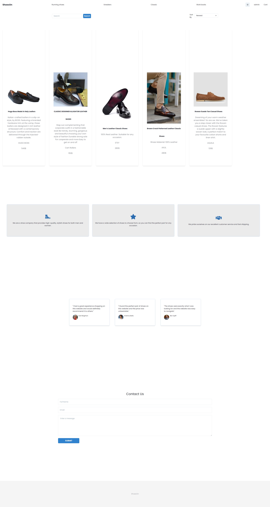
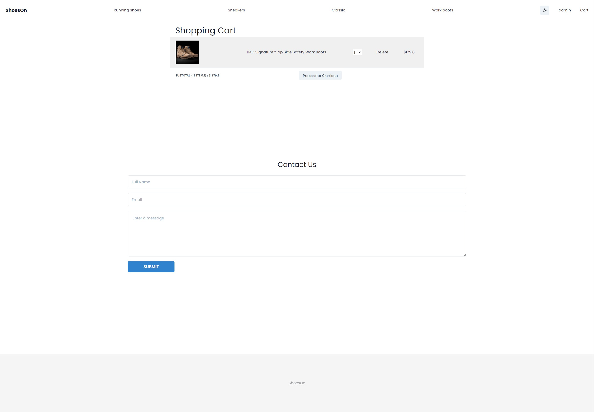
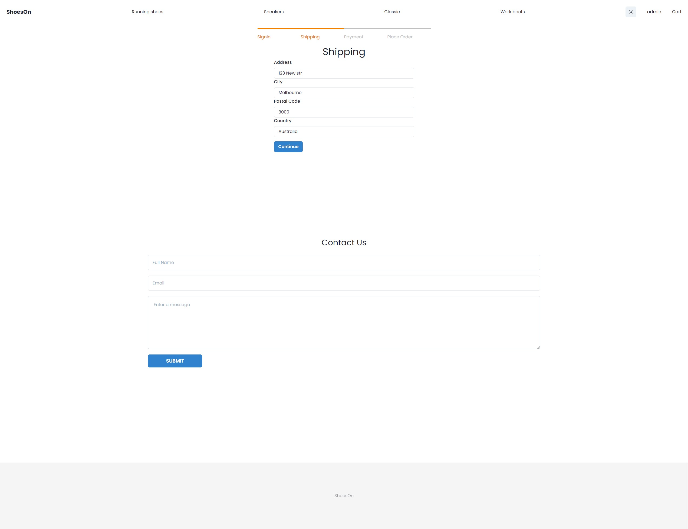
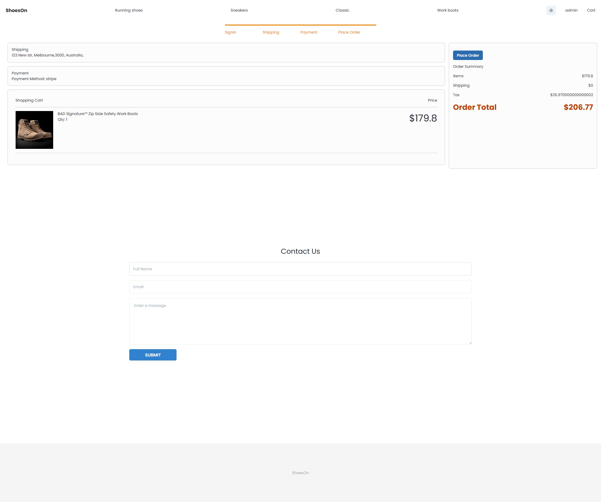
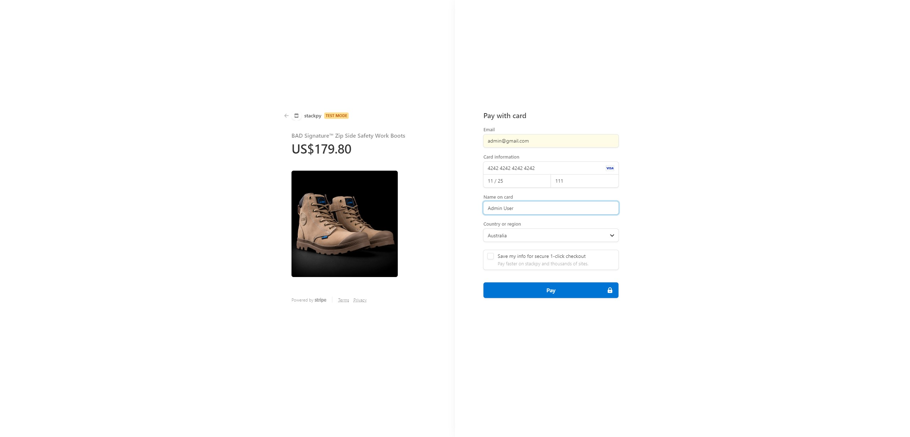

# Personal Portfolio

## Description

- E- commerce website.
- Onlinle shop for shoe lovers.
- Website created using `MERN stack`.

## Table of Contents

- [Installation](#installation)
- [Usage](#usage)
- [License](#license)
- [Contributing](#contributing)
- [Tests](#tests)
- [Demo](#demo)
- [Screenshot](#screenshot)
- [Questions](#questions)

## Installation

- Clone repository to use this application on local machine.
- `Node.js` is required.
- Install necessary dependencies by running `npm install`

## Usage

- Once everything has been installed run `npm run develoop` in the root folder.
- The application will start and you can sign up and explore through the website.
- `NOTE: In order to see full functioanality you need to use your own env`
- To create users run `npm run seed` in root folder.
- Then you can login as `admin` and create products.
- You can upload images from your local machine or using a web image link.

## License

This project is licensed under 

## Contributing

- N/A

## Tests

- N/A

## Demo

- Please follow this [Heroku link](https://shoes-on.herokuapp.com/) to visit the deployed application on Heroku.

## Screenshot

- Please see the screenshots below.

## Questions

If you have any questions regarding the project you can contact me directly at artlil420@gmail.com.
Please feel free to view more of my projects at https://github.com/Artur0705
